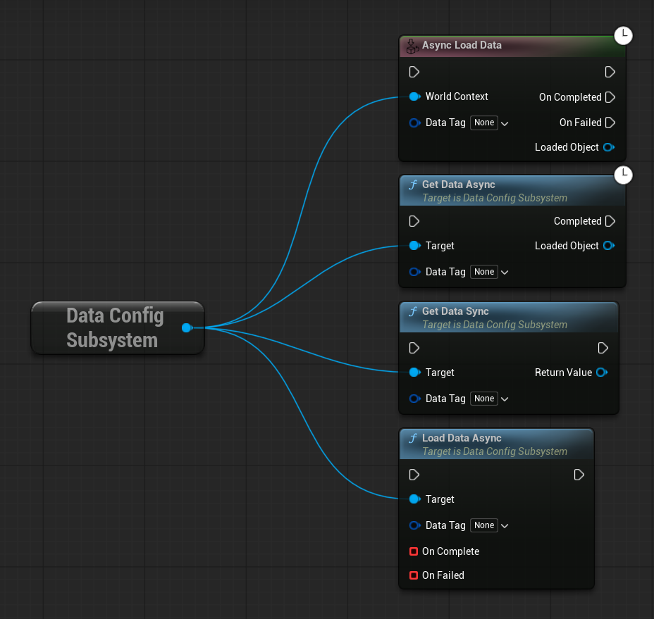

# DataConfigSystem

**DataConfigSystem** is a powerful and lightweight global configuration system for Unreal Engine 5 that allows you to store, manage, and asynchronously load assets using GameplayTags. Originally designed for loading game configuration data like DataTables and DataAssets, but basically can be used for loading any UObject-derived asset in a centralized, type-safe manner.

## Features

- **GameplayTag-based asset management** - Store and retrieve any UObject-derived assets using GameplayTags
- **Asynchronous loading** - Non-blocking asset loading with full Blueprint and C++ support
- **Developer Settings integration** - Easy configuration through Project Settings UI
- **Custom Blueprint node** - Dedicated "Async Load Data" node with automatic type casting
- **Asset validation** - Built-in validation system with class filtering and automatic cleanup
- **Flexible architecture** - Supports DataTables, DataAssets, Blueprint classes, and any UObject-derived assets
- **Lightweight** - Minimal performance overhead with intelligent caching system

## Requirements

- Unreal Engine 5.0+
- GameplayTags plugin (usually enabled by default)

## Installation

### Method 1: Git Clone
```bash
cd YourUnrealProject/Plugins
git clone https://github.com/YourUsername/DataConfigSystem.git
```

### Method 2: Manual Download
1. Download the plugin files
2. Extract to `YourUnrealProject/Plugins/DataConfigSystem/`

### Build Steps
1. Regenerate project files (right-click `.uproject` → "Generate Visual Studio project files")
2. Build the project in your IDE or through the editor
3. Enable the plugin: `Edit → Plugins → Project → Data Config System`

### Method 3: Download already packaged plugin from [Releases](https://github.com/PsinaDev/Unreal-Config-Data-Plugin/releases)

## Quick Start

### 1. Configure Your Assets

1. Open **Project Settings → Game → Data Configuration Settings**
2. Configure **Class Filters** to specify which asset types are allowed (e.g., `DataTable`, `PrimaryDataAsset`)
3. Add your assets to the **Data** map using GameplayTags as keys


### 2. Blueprint Usage

#### Using the Custom Async Load Data Node:

The plugin provides a custom Blueprint node that automatically handles type casting and async loading:


#### Using Blueprint Functions:

You can also use the subsystem functions directly:



### 3. C++ Usage

#### Basic Usage
```cpp
// Header file
UCLASS()
class YOURGAME_API AYourActor : public AActor
{
    GENERATED_BODY()

private:
    UPROPERTY()
    class UDataConfigSubsystem* DataConfigSubsystem;
    
    UFUNCTION()
    void OnDataLoadComplete(UObject* LoadedObject);
    
    UFUNCTION()
    void OnDataLoadFailed();
};

// Implementation
void AYourActor::BeginPlay()
{
    Super::BeginPlay();
    
    // Get the subsystem
    if (UGameInstance* GameInstance = GetGameInstance())
    {
        DataConfigSubsystem = GameInstance->GetSubsystem<UDataConfigSubsystem>();
    }
    
    // Load data synchronously
    FGameplayTag PlayerStatsTag = FGameplayTag::RequestGameplayTag("Config.PlayerStats");
    if (UDataTable* PlayerStats = Cast<UDataTable>(DataConfigSubsystem->GetDataSync(PlayerStatsTag)))
    {
        // Use your data table
        UE_LOG(LogTemp, Log, TEXT("Loaded PlayerStats DataTable"));
    }
    
    // Load data asynchronously
    FOnDataLoadComplete OnComplete;
    FOnDataLoadFailed OnFailed;
    OnComplete.BindDynamic(this, &AYourActor::OnDataLoadComplete);
    OnFailed.BindDynamic(this, &AYourActor::OnDataLoadFailed);
    
    DataConfigSubsystem->LoadDataAsync(PlayerStatsTag, OnComplete, OnFailed);
}

void AYourActor::OnDataLoadComplete(UObject* LoadedObject)
{
    if (UDataTable* DataTable = Cast<UDataTable>(LoadedObject))
    {
        UE_LOG(LogTemp, Log, TEXT("Async load completed: %s"), *DataTable->GetName());
    }
}

void AYourActor::OnDataLoadFailed()
{
    UE_LOG(LogTemp, Warning, TEXT("Failed to load data"));
}
```

#### Advanced Usage with Template Functions
```cpp
template<typename T>
T* LoadDataOfType(const FGameplayTag& DataTag)
{
    if (DataConfigSubsystem)
    {
        return Cast<T>(DataConfigSubsystem->GetDataSync(DataTag));
    }
    return nullptr;
}

if (UDataTable* MyTable = LoadDataOfType<UDataTable>(FGameplayTag::RequestGameplayTag("Config.Items")))
{
    // Work with strongly typed data table
}
```

## Configuration Options

### Developer Settings Properties


- **Data Map** - Core mapping of GameplayTags to asset references
- **Class Filters** - Restricts which asset types can be added
- **Validation Settings** - Controls automatic asset validation behavior

### Validation Features

The system includes comprehensive validation:

- **Strict Validation** - Automatically validates assets against class filters
- **Auto Remove Invalid Assets** - Cleans up invalid entries automatically
- **Verbose Logging** - Detailed validation logs for debugging


## API Reference

### UDataConfigSubsystem

#### Key Methods

```cpp
// Synchronous loading
UFUNCTION(BlueprintCallable, Category="Data Config")
UObject* GetDataSync(FGameplayTag DataTag);

// Asynchronous loading
UFUNCTION(BlueprintCallable, Category="Data Config")
void LoadDataAsync(FGameplayTag DataTag, FOnDataLoadComplete OnComplete, FOnDataLoadFailed OnFailed);

// Utility functions
UFUNCTION(BlueprintCallable, BlueprintPure, Category="Data Config")
bool HasDataForTag(FGameplayTag DataTag) const;

UFUNCTION(BlueprintCallable, BlueprintPure, Category="Data Config")
UClass* GetExpectedClassForTag(FGameplayTag DataTag) const;
```

### UDataDevSettings

#### Configuration Methods

```cpp
// Asset management
UFUNCTION(BlueprintCallable, BlueprintPure, Category="Data Configuration")
const TMap<FGameplayTag, TSoftObjectPtr<UObject>>& GetData() const;

UFUNCTION(BlueprintCallable, Category="Data Configuration")
UObject* LoadObjectForTag(FGameplayTag DataTag) const;

// Validation (Editor only)
UFUNCTION(Category="Data Configuration")
void ValidateAllAssets();

UFUNCTION(Category="Data Configuration") 
void ClearInvalidAssets();
```


## Contributing

We welcome contributions! Please see our contributing guidelines:

1. Fork the repository
2. Create a feature branch
3. Make your changes with appropriate tests
4. Submit a pull request

## Authors

- **[Stalker7274 (Roma)](https://github.com/Stalker72742)** — Subsystem & asset loading architecture
- **[PsinaDev (Kim)](https://github.com/PsinaDev)** — Blueprint nodes & Developer Settings integration

## License

This project is licensed under the MIT License - see the LICENSE file for details.

## Support

For issues, feature requests, and support:

- **GitHub Issues**: [DataConfigSystem Issues](https://github.com/YourUsername/DataConfigSystem/issues)
